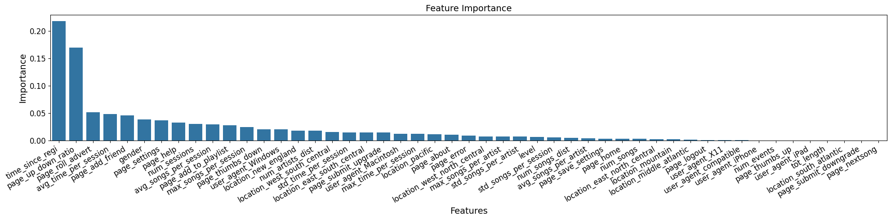

# Predicting churns with Spark
This project predicts churn using PySpark on a sample dataset derived from a larger 12GB dataset of the fictitious music service platform, **“Spartify”**
> You can check more from the [Medium blogs](https://medium.com/@hideonhp/leveraging-apache-spark-to-predict-customer-churn-in-music-streaming-services-d9bd89a140dd) for more details

## 1. Motivation
Customer attrition (or erosion) is a critical business issue because the cost of regaining a lost customer is considerably more than investing in keeping the existing one. Forecasting churn means that a company is able to focus on the specific target customer retention strategy where retention programs are executed even as the churn occurs.

For this project, I decided to apply [Apache Spark](https://spark.apache.org/) to analyze the logs of user activity dataset and create a machine learning model to predict users most likely to churn.

## 2. Datasets
- User activity dataset: [Udacity](https://www.udacity.com/)
    > The dataset contains user information (e.g., name, gender, state) and actions (e.g., the song listened to, the type of event, the device used) performed at one or more times.

- This table was created from the Census regions table available on [Cphalpert’s GitHub](https://github.com/cphalpert/census-regions).
    > It shows the relationship between states and geographical area divisions.

Explorations and pilot modeling were conducted using an initial sample of data (~120MB), while the final dataset for machine learning model training consisted of the full 12GB.

## 3. What have done in the notebook
### 3.1. Data Preprocessing
- Load a subset of data from JSON
- Handle missing data

### 3.2. Exploratory Data Analysis (EDA)
- Summary of numerical columns: Basic statistics
- Summary of non-numerical columns: Identify potential categories
- Define churn as the cancellation of service
- Analyze the behavior of churn vs. non-churn users in the following aspects:
    - Usage patterns at different times of the day
    - Usage trends across different days of the week
    - User types (free vs. paid accounts)
    - Interaction types (e.g., adding friends, viewing advertisements, giving thumbs up)
    - Device preferences (e.g., Mac, Windows)
    - Geographic distribution of users (e.g., New England, Pacific regions)
    - Time elapsed from downgrade to churn

### 3.3. Feature Engineering for ML
- Generate user-level features:
    - Most recent user level
    - Time since account creation
    - User's gender
    - User's interaction metrics: number of songs, artists, and sessions
    - Average and standard deviation of songs per artist, per session, and session duration
    - Device type
    - Frequency and proportion of each event type
    - User’s location
- Remove highly correlated features (retain one from each correlated pair)
- Transform features to approximate normal distributions
- Organize feature engineering code for scalability

### 3.4. Machine Learning Pipeline Development
- Split data into training and testing sets
- Define performance evaluation metrics
- Create utility functions for building the cross-validation pipeline, training the model, and assessing model performance
- Evaluate initial models using:
    - Baseline prediction (naive approach)
    - Logistic regression
    - Random forest
    - Gradient-boosted tree

## 4. Results
| **Model**                | **Train Time (s)** | **F1 Train** | **Acc Train** | **F1 Test** | **Acc Test** | **Prediction Time (s)** |
|--------------------------|-------------------|-------------|-------------|------------|------------|-------------------------|
| **Naive Model**          | -                 | -           | -           | **0.6684** | **0.7689** | -                      |
| **Logistic Regression**  | 648.1715          | 0.8685      | 0.8729      | 0.6706     | 0.6818     | 1.3453                 |
| **Random Forest**        | 696.1144          | 0.9165      | 0.9227      | **0.6429** | **0.7500** | 0.9643                 |
| **Gradient-Boosted Tree**| 564.1485          | **1.0**     | **1.0**     | 0.6714     | 0.6591     | **0.7612**             |
> Visualize feature importance for Gradient-Boosted Tree

## 5. Final Model
Reason for Selection: Based on the evaluation metrics, the Random Forest model is selected as the final model due to its superior test accuracy (75.0%) and reasonable generalization performance. It balances predictive power with fast prediction times.

### 5.1 Extract and Analyze Final Model Parameters
Below is a description of each parameter and how it affects the model's functionality:

- Number of Trees: 20
  - This specifies the number of decision trees in the Random Forest ensemble.
  - **Significance**: A larger number of trees can improve stability and accuracy by reducing variance. However, it increases computational time. For this dataset, 20 trees provided a good balance between performance and efficiency.

- Max Depth: 5
  - This limits the maximum depth of each decision tree.
  - **Significance**: A depth of 5 prevents overfitting by restricting the complexity of the trees, ensuring that the model generalizes well to unseen data.

- Max Features: auto
  - This determines the number of features considered for splitting at each tree node.
  - **Significance**: The auto setting lets the model automatically select an optimal subset of features, balancing randomness and predictive power.

- Min Instances Per Node: 1
  - This sets the minimum number of data instances required to split a node.
  - **Significance**: A value of 1 allows the trees to grow fully to their maximum depth but may risk overfitting in some cases. In this scenario, it works well with the limited depth of 5.

### 5.2 Impact of Parameters on Performance
Analysis and Insights:
- Max Depth:
  - Tested Value: 5
  - Impact on Performance: The model with a max depth of 5 gives a moderate performance with an accuracy of 72.4% and an F1 score of 0.61. This indicates that limiting the depth of trees helps reduce overfitting and keeps the model generalizable.
  - Reasoning: A smaller max depth restricts the complexity of each decision tree, preventing overfitting. The performance here suggests that a depth of 5 strikes a balance between capturing patterns and maintaining simplicity.

- Number of Trees:
  - Tested Value: 50
  - Impact on Performance: Increasing the number of trees to 50 improves the model's accuracy to 75.0% and the F1 score to 0.64. The increase in performance highlights the importance of ensemble learning in random forests, where adding more trees helps reduce variance and improve predictions.
  - Reasoning: More trees generally improve model performance by averaging out predictions, but they also come with an increased computational cost. In this case, 50 trees offered a good performance boost with manageable computation.
 
### 5.3 Model Robustness Assessment with Cross-Validation

#### Cross-Validation Results
To assess the robustness of our Random Forest model, we performed cross-validation to fine-tune its hyperparameters. The 5-fold cross-validation yielded the following results:

- Average Accuracy from Cross-Validation: 0.7588 (75.88%)
  - This indicates that, on average, the model performs consistently well across different subsets of the data.
- Best Hyperparameters from Cross-Validation:
  - Number of Trees: 100
  - Max Depth: 5

These results suggest that 100 trees and a max depth of 5 yield the best trade-off between performance and model complexity.

#### Impact of Parameters on Performance
The following table summarizes the performance of the model with different values for the hyperparameters Max Depth and Number of Trees during cross-validation:

| **Parameter**    | **Value Tested** | **Accuracy** | **F1 Score** |
|------------------|------------------|--------------|--------------|
| Max Depth        | 5                | 0.724        | 0.61         |
| Number of Trees  | 50               | 0.750        | 0.64         |
| Number of Trees  | 100              | **0.7588**   | **0.66**     |

> Number of Trees: Increasing the number of trees to 100 significantly improved model performance compared to using a smaller number of trees (such as 20 or 50). A higher number of trees generally increases the model's ability to capture complex patterns but can also lead to longer training times.

> Max Depth: A Max Depth of 5 proved to be the optimal balance for preventing overfitting. A deeper tree would have allowed the model to capture more complex relationships in the data but could have led to overfitting. A smaller depth might have underfit the model, so 5 provided a reasonable trade-off.

#### Conclusion

The cross-validation results confirm that the optimal hyperparameters for the Random Forest model are:

- Number of Trees: 100
- Max Depth: 5

This combination of hyperparameters has achieved a solid performance with an accuracy of 75.88%, making it a robust and reliable model for predicting the target variable. The next step is to evaluate this final model on the test data to confirm its generalization performance.

### 5.4 Detailed Evaluation of the Final Model
Final Model Parameters:
- Number of Trees: 100
- Max Depth: 5

Parameter Impact:
- Number of Trees (100):
  - Significance: More trees reduce variance and improve stability, but beyond a certain point, gains are minimal.
  - Impact on Performance: Increasing from 50 to 100 improved accuracy and F1 score. More trees help reduce overfitting and provide better generalization.
  - Trade-off: A larger number of trees increases computation time but improves performance.

- Max Depth (5):
  - Significance: Limits tree growth to prevent overfitting. Deeper trees capture more complexity but may overfit.
  - Impact on Performance: Max depth of 5 strikes a balance between capturing patterns and avoiding overfitting.
  - Trade-off: A deeper tree may improve performance, but it risks overfitting, so 5 is chosen to maintain generalization.

Model Selection Justification:

- Accuracy vs. F1 Score: The final model (100 trees, max depth 5) provides a solid balance between accuracy (0.7588) and F1 score (0.64).
- Cross-validation confirmed that these parameters minimize overfitting while maximizing performance.

Conclusion:

The Random Forest model with 100 trees and a max depth of 5 delivers the best performance and generalization. This setup provides a good balance of complexity and accuracy, with minimal overfitting risk.

## 6. Model Comparison and Final Evaluation after Hypertuning with Grid Search

| Model                     | Accuracy | F1 Score | Training Time (s) | Prediction Time (s) |
|---------------------------|----------|----------|-------------------|---------------------|
| Naive Model               | 0.7689   | 0.6684   | -                 | -                   |
| Logistic Regression       | 0.6818   | 0.6706   | 648.17            | 1.35                |
| Random Forest (Final)     | 0.7588   | 0.6400   | 696.11            | 0.96                |
| Gradient-Boosted Tree     | 0.6591   | 0.6714   | 564.15            | 0.76                |

Key Insights:
- Naive Model: The baseline model provides an accuracy of 0.7689 and an F1 score of 0.6684, setting a reference point.

- Logistic Regression: While it has a relatively fast prediction time (1.35s), its performance (accuracy = 0.6818, F1 score = 0.6706) is not as good as the Random Forest model, which indicates limited generalization capability compared to the Random Forest.

- Random Forest: With the final model (100 trees, max depth = 5), it achieves a good balance of accuracy (0.7588) and F1 score (0.6400), showing good performance while maintaining generalization. It has a moderate training time and a quick prediction time.

- Gradient-Boosted Tree: This model achieved perfect training metrics but overfitted, as seen by the much lower test accuracy (0.6591). Despite fast training and prediction times, this model requires tuning to reduce overfitting.

Conclusion:

The **Random Forest** model, with 100 trees and a max depth of 5, performs the best in terms of test accuracy while striking a balance between training and prediction time. While Gradient-Boosted Trees showed high training performance, they suffered from overfitting, making Random Forest the more reliable option for this dataset.

## 7. Potential Improvements and Solutions
After evaluating the model's performance, I identified several areas where the current implementation could be improved. These improvements aim to boost model performance, address challenges like overfitting and class imbalance, and enhance model interpretability. Below, I discuss specific improvements and their potential impact:

### 7.1. Hyperparameter Tuning: More Efficient Search Methods

Currently, I used **grid search** for hyperparameter tuning. However, this method can be computationally expensive, especially when testing a large number of combinations.

#### Improvement: Use of Randomized Search or Bayesian Optimization
- **Randomized Search** randomly samples hyperparameter values and can find similar results with fewer computations.
- **Bayesian Optimization** builds a probabilistic model and samples the hyperparameter space based on previous evaluations, potentially leading to better results with fewer iterations.

**Impact**: This would speed up the hyperparameter tuning process and could lead to finding better model configurations with less computational cost.

### 7.2. Regularization to Avoid Overfitting

The model shows some signs of **overfitting** as it performs well on the training set but not as well on the test set.

#### Improvement: Apply Regularization Techniques
- **Pruning trees** or **limiting tree depth** could prevent the model from growing overly complex, thus reducing overfitting.
- **Increasing minimum samples per leaf** can simplify the model and help with generalization.

**Impact**: The model would generalize better on unseen data, potentially improving performance on the test set.

### 7.3. Handling Imbalanced Data

The dataset may have some level of **class imbalance**, where one class is underrepresented. This can lead to biased predictions, especially in models like **Random Forest**.

#### Improvement: Resampling Techniques (SMOTE or Class Weights)
- **SMOTE (Synthetic Minority Over-sampling Technique)** can be used to generate synthetic samples for the minority class.
- Alternatively, adjusting **class weights** in the Random Forest model can help give more importance to the minority class during training.

**Impact**: By addressing the class imbalance, the model would improve in predicting the minority class and provide more balanced performance across all classes.

### 7.4. Ensembling Methods for Improved Accuracy

While Random Forest is a strong model, other techniques may offer better performance when combined with it.

#### Improvement: Use of Boosting or Stacking
- **Boosting** algorithms such as **XGBoost** or **LightGBM** focus on sequentially improving model predictions, making them powerful for classification tasks.
- **Stacking** combines predictions from multiple models to improve overall accuracy.

**Impact**: These methods could improve the model’s performance by focusing on weaknesses in the current Random Forest model. However, they are more computationally expensive.

### 7.5. Model Interpretability

For complex models like Random Forest, understanding how the model makes decisions is important, especially in critical domains where interpretability is key.

#### Improvement: Use SHAP or LIME for Model Explanation
- **SHAP (SHapley Additive exPlanations)** or **LIME (Local Interpretable Model-agnostic Explanations)** could be applied to improve the interpretability of model predictions.

**Impact**: These methods would allow for better understanding of feature importance and decision-making, increasing trust in the model's predictions.

### 7.6 Conclusion on Improvements

While the Random Forest model has provided reasonable performance, there are several improvements that could make the model more efficient and robust. These include:
- Using **randomized search** or **Bayesian optimization** for more efficient hyperparameter tuning.
- Applying **regularization** techniques to prevent overfitting.
- Using **resampling methods** to handle class imbalance.
- Exploring **boosting** or **stacking** for potentially better accuracy.
- Implementing **SHAP** or **LIME** for model interpretability.

Each of these solutions would address different aspects of model performance, making it more generalizable, accurate, and transparent. However, there are trade-offs, such as increased computational cost or complexity, that must be considered.

## 8. Installation

Prototype on Google Colab: The code was developed using Google Colab, with Python version 3. Libraries used include PySpark, Pandas, Seaborn, and Matplotlib.

## 9. Project Files Overview

- Sparkify.ipynb: This notebook contains the exploratory data analysis, data cleaning, and preliminary machine learning model development using a sample of the user activity dataset on a local machine.
- mini_sparkify_event_data.json: A smaller portion of the user activity data, used for initial testing and analysis.
- us census bureau regions and divisions.csv: A CSV file containing data on U.S. census bureau regions and divisions, used for geographical segmentation.

> You can check more from the [Medium blogs](https://medium.com/@hideonhp/leveraging-apache-spark-to-predict-customer-churn-in-music-streaming-services-d9bd89a140dd) for more details
